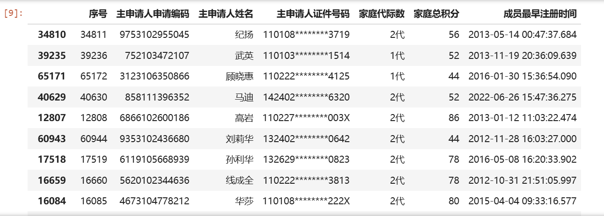
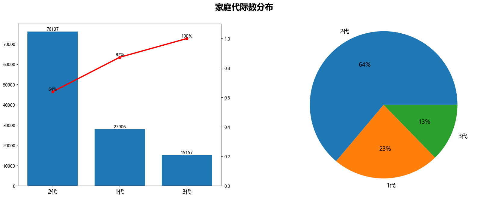
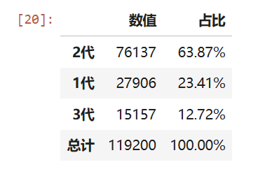
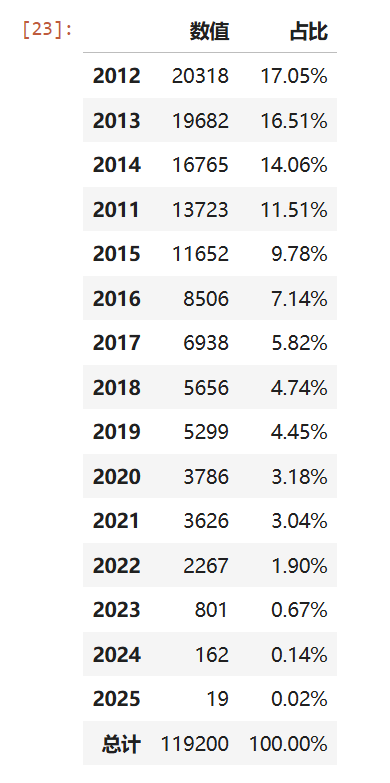
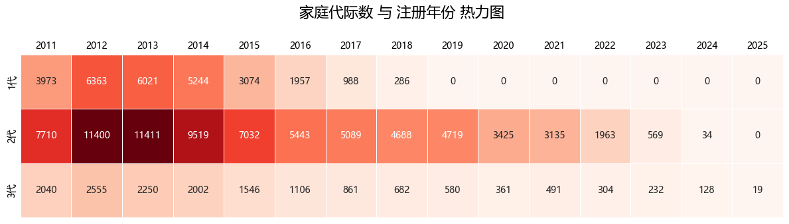
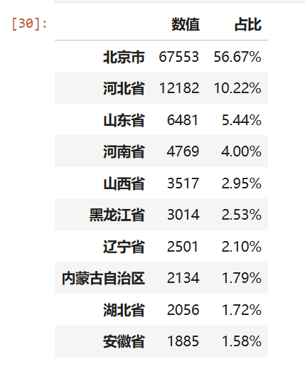
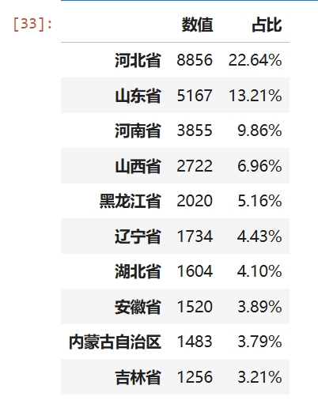
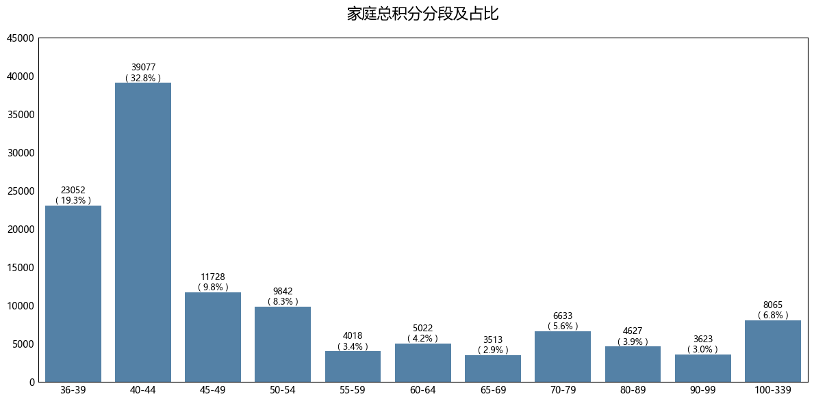

# 背景

北京2026年新能源家庭指标名单已经公布，官方提供了一份脱敏后的PDF版详细数据。本文将使用Python生态中的常用工具，对这份名单进行一次探索性分析

文章的重点不是数据结论，而是展示如何利用 `pdfplumber`、`pandas`、`matplotlib` 等库完成数据提取、清洗、统计与可视化，希望能为有类似需求的朋友提供一些实战参考

*说明：本篇文章重点是利用Python工具进行数据分析，而不看重数据结论*


# 分析路线图
在开始敲代码之前，先明确一下本次分析将要回答的几个问题：
- 获得指标的家庭，积分最高和最低分别是多少？
- 家庭代际数（几代人）的分布是怎样的？
- 主申请人都是什么时候开始注册排队的？
- 家庭代际数与注册年份之间有什么交叉关系？
- 主申请人主要来自哪些省份？非京籍的“新北京人”又占多少？
- 家庭总积分的分段分布情况如何？

带着这些问题，我们一步步往下走
>本文所有代码均在文末附录的环境中运行，并已预先导入所需库


# 一、数据提取：从PDF中“挖”出表格

官方数据为PDF文件，首先需要将表格提取出来，并保存到Excel，核查数据提取是否有误，且可以反复使用

这里使用`pdfplumber`库，它对于规整的表格提取效果很好

```python 
dfs=[]

with pdfplumber.open("202601FamilyXny.pdf") as pdf:
    for page in pdf.pages:
        # 提取当前页面中所有表格，返回list列表
        tables = page.extract_tables()

        for i, table in enumerate(tables):
            # table 是二维列表，第一行通常是表头
            df = pd.DataFrame(table[1:], columns=table[0])

            dfs.append(df)

data=pd.concat(dfs,axis=0)
data = data.set_index('序号')
data.columns = data.columns.str.replace('\n', '', regex=False)

# 从PDF提取该数据耗时大约 20min，建议耐心等待
data.to_excel('202601FamilyXny.xlsx')
```

提取完成后简单浏览Excel，数据基本无误，可以进入分析环节


# 二、工具准备：加载数据与自定义函数

先加载保存好的Excel数据，并随机抽查30条记录，确认读取正常

```python 
data = pd.read_excel('202601FamilyXny.xlsx')

data['家庭代际数']=data['家庭代际数'].map(lambda x: f'{str(x)}代')

# 随机抽取30条数据进行查看
data.sample(30)
```



为了使后续分析更简洁高效，这里封装两个工具函数：
1. `pivot_percent`：类似Excel透视表，按分组统计后自动计算占比，并添加总计行
2. `axes_plot`：用于快速生成“柱形图（可选双轴累计百分比）+饼图”的组合图

```python 
# 类似 Excel 数据透视表函数
def pivot_percent(df, index, value, decimal=2, agg='sum'):
    '''
    生成透视表并计算占比（支持 sum / count 等聚合方式）
    
    df: 数据框
    index: 分组维度（列名）
    value: 要聚合的数值列（count 时也需指定，比如用任意非空列计数）
    decimal: 百分比保留的小数位数
    agg: 聚合方式，如 'sum'、'count'、'mean' 等
    '''

    # 1. 生成透视表（按 index 分组，对 value 列应用 agg 聚合）
    data_pivot = pd.pivot_table(df, 
                                values=value, 
                                index=index, 
                                aggfunc=agg
                               )
    
    
    # 2. 计算占比
    data_pivot['占比'] = data_pivot[value] / data_pivot[value].sum()
    
    # 3. 按聚合值降序排列
    data_pivot = data_pivot.sort_values(by=value, ascending=False)
    
    # 4. 添加总计行（聚合值合计，占比为 1）
    data_new = pd.DataFrame([[data_pivot[value].sum(), 1]],
                            columns=data_pivot.columns,
                            index=['总计'])
    data_result = pd.concat([data_pivot, data_new], ignore_index=False)
    
    # 5. 格式化百分比列
    data_result['占比'] = data_result['占比'].map(lambda x: f'{x:.{decimal}%}')

    data_result = data_result.rename(columns={value:'数值'})
    
    return data_result


#左侧柱形图，右侧饼图
def axes_plot(axs1,axs2,x,y,rotation=0,axs1_twinx=False):

    #柱形图
    axs1.bar(x,y,width=0.75,align='center')
    for a,b in zip(x,y):
        axs1.text(a,b,b,ha='center',va='bottom')
    axs1.tick_params(axis='x')

    #修改x坐标轴
    axs1.xaxis.set_major_locator(mticker.FixedLocator(range(len(x))))
    axs1.set_xticklabels(x, rotation=rotation, fontsize=14)

    #累计百分比
    if axs1_twinx:
        axs_twinx=axs1.twinx()
        y_twinx=np.array(y).cumsum()/np.array(y).sum()
        axs_twinx.plot(x,y_twinx,'r-o',linewidth=3)
        axs_twinx.set_ylim(0,1.1)

        for a,b in zip(x,y_twinx):
            axs_twinx.text(a,b,f'{b:.0%}',ha='center',va='bottom')


    #饼图
    axs2.pie(y,labels=x,autopct='%.0f%%',textprops={'fontsize':14,'color':'k'})
    axs2.axis('equal')

```
后面的分析中，这两个函数会反复出现


# 三、分维度探索
## 1. 积分极值：最高与最低
**最高积分 330 分，最低积分 36 分**，积分跨度很大

```python
print('最高积分：', data['家庭总积分'].max())  #最高积分： 330
print('最低积分：', data['家庭总积分'].min())  #最低积分： 36
```
<br/>

## 2. 家庭代际数分布：几代人一起申请？
**2代及以上家庭占比高达77%**，1代家庭仅占23%（27906个指标），多代家庭在积分上具有明显优势

```python 
data_inter_num_plot=data['家庭代际数'].value_counts().reset_index()

fig,axes=plt.subplots(1,2,figsize=(20,7),facecolor='white')
fontsize=15

x=data_inter_num_plot['家庭代际数']
y=data_inter_num_plot['count']
axes_plot(axes[0],axes[1],x,y,axs1_twinx=True)

fig.suptitle('家庭代际数分布',fontsize=20,fontweight ="bold",y=0.98)
plt.subplots_adjust(hspace=0.35,wspace=0.3)
plt.show()
```


同时用自定义函数输出精确统计表：
```python 
data_inter_num_stat=pivot_percent(data,'家庭代际数','主申请人申请编码',agg='count')

data_inter_num_stat
```



<br/>

## 3. 主申请人注册年份分布：排队多久了？

**2015年及之前年份占比接近 7成**，早注册早积累积分，这是获得指标的关键

```python 
def register_year(dt):
    return dt[:4]
    
data['成员最早注册时间-年份']=data['成员最早注册时间'].map(register_year)

pivot_percent(data,'成员最早注册时间-年份','主申请人申请编码',agg='count')
```


<br/>

## 4. 交叉分析：代际数 × 注册年份

**2012年和2013年注册的“2代家庭”各自获得了超过1万个指标**，是绝对的主力群体

```python 
inter_num_reg_year=pd.pivot_table(data, 
               values='主申请人申请编码', 
               index='家庭代际数', 
               columns='成员最早注册时间-年份', 
               aggfunc='count',
               fill_value=0
              )
              
plt.figure(figsize=(12, 3.5))  # 调整图片宽度和高度
ax = sns.heatmap(
    inter_num_reg_year,
    annot=True,              # 在每个格子中显示数值
    fmt='d',                 # 数值格式：整数
    cmap='Reds',           # 颜色映射（黄-橙-红）
    linewidths=0.5,          # 格子之间的分隔线宽度
    cbar=False,
    # cbar_kws={'shrink': 0.8} # 颜色条大小
)

ax.xaxis.tick_top()          # 将 x 轴的刻度线移动到顶部
ax.tick_params(length=0)

plt.title('家庭代际数 与 注册年份 热力图', fontsize=16,pad=40)
plt.xlabel('')
plt.ylabel('')
# plt.xticks(rotation=45)     # 如果年份过多，旋转标签避免重叠
plt.tight_layout()
plt.show()
```



<br/>

## 5. 主申请人籍贯分布：来自哪里？
**北京本地籍贯占比56%**，其余主要来自周边的山河四省，以及东北省份等，地缘特征十分明显
```python 
def map_province(x):
    province_code = x[:2]
    province = {
        '11': '北京市', '12': '天津市', '13': '河北省', '14': '山西省',
        '15': '内蒙古自治区', '21': '辽宁省', '22': '吉林省', '23': '黑龙江省',
        '31': '上海市', '32': '江苏省', '33': '浙江省', '34': '安徽省',
        '35': '福建省', '36': '江西省', '37': '山东省', '41': '河南省',
        '42': '湖北省', '43': '湖南省', '44': '广东省', '45': '广西壮族自治区',
        '46': '海南省', '50': '重庆市', '51': '四川省', '52': '贵州省',
        '53': '云南省', '54': '西藏自治区', '61': '陕西省', '62': '甘肃省',
        '63': '青海省', '64': '宁夏回族自治区', '65': '新疆维吾尔自治区'
    }
    return province.get(province_code, '其他')

data['主申请人籍贯省份'] = data['主申请人证件号码'].map(map_province)
pivot_percent(data, '主申请人籍贯省份', '主申请人申请编码', agg='count').head(10)
```



如果把范围缩小到“新北京人”（非京籍、且家庭代际数≥2），前10名如下：

```python 
# 新北京人：主申请人籍贯省份-非北京， 家庭代际数>=2
data_filter = data[(data['家庭代际数'].isin(['2代', '3代'])) & (data['主申请人籍贯省份'] != '北京市')]

pivot_percent(data_filter,'主申请人籍贯省份','主申请人申请编码',agg='count').head(10)
```


<br/>

## 6. 家庭总积分分段分布：大多数人在哪个区间？

**积分高度集中在36-44分段，占据了超过一半的指标**，只要积分达到“入围线”附近，就有很大概率获得指标，高分家庭反而是少数

```python 
# 分段边界
bins = [36, 40, 45, 50, 55, 60, 65, 70, 80, 90, 100, 340]
labels = [f'{bins[i]}-{bins[i+1]-1}' for i in range(len(bins)-1)]

# ---------- 1. 分段 ----------
data['总积分段'] = pd.cut(data['家庭总积分'], 
                      bins=bins, 
                      labels=labels, 
                      right=False
                     )

# ---------- 2. 画等宽柱状图 ----------
plt.figure(figsize=(12, 6))
ax = sns.countplot(data=data, 
                   x='总积分段',
                   color='steelblue', 
                   order=labels
                  )

# ---------- 3. 在柱子上标注频数和占比 ----------
total = len(data)  # 总样本数
for p in ax.patches:
    height = p.get_height()          # 频数
    if height == 0:
        continue                     # 跳过空桶
    percent = height / total * 100   # 占比（%）
    # 在柱子上方 5 像素处标注（两行：频数 + 占比）
    ax.text(p.get_x() + p.get_width()/2., 
            height + 5,
            f'{int(height)}\n( {percent:.1f}% )',
            ha='center', 
            va='bottom', 
            fontsize=9)

# ---------- 4. 美化 ----------
# plt.xticks(rotation=45)
plt.title('家庭总积分分段及占比', fontsize=16, pad=20)
plt.ylabel('')
plt.xlabel('')
ax.tick_params(length=0)
plt.tight_layout()
plt.ylim(0,45000)
plt.show()
```




# 工具小结
回顾整个分析流程，我们用到的关键技术点：
- `pdfplumber`：批量提取PDF中的表格，应对非结构化数据
- `pandas`：透视表、数据分组、自定义映射、分段切割，几乎覆盖所有数据整理需求
- 自定义函数`pivot_percent`和`axes_plot`：将重复逻辑封装起来，让分析代码更干净，也体现了Python在数据处理中的灵活性
- `matplotlib`+`seaborn`：通过柱状图、饼图、热力图、双轴图直观展示分布和交叉关系，并处理了中文显示问题

本篇文章不追求深刻的业务结论，而是希望呈现一个真实的Python数据分析流程：从PDF挖数据，到清洗、聚合、可视化，再到自定义工具函数的沉淀


# 完整环境配置
基于 jupyter notebook 环境
```python 
import sys

print('python 版本：', sys.version.split('|')[0]) 
#python 版本： 3.11.14 

import pdfplumber
import pandas as pd
import numpy as np
import seaborn as sns
import matplotlib

print('pdfplumber 版本：', pdfplumber.__version__)  
#pdfplumber 版本： 0.11.9

print('numpy 版本：', np.__version__) 
#numpy 版本： 2.4.2

print('pandas 版本：', pd.__version__) 
#pandas 版本： 3.0.0

print('seaborn 版本：', sns.__version__) 
#seaborn 版本： 0.13.2

print('matplotlib 版本：', matplotlib.__version__) 
#matplotlib 版本： 3.10.8

import matplotlib.pyplot as plt
import matplotlib.ticker as mticker

#画图中文乱码、负号
plt.rcParams['font.sans-serif']=['Microsoft YaHei']
plt.rcParams['axes.unicode_minus']=False
```


# 历史相关文章
- [Matplotlib 自定义函数实现左边柱形图，右边饼图](../../数据可视化/Matplotlib-自定义函数实现左边柱形图，右边饼图/)
- [对比Excel，利用pandas进行数据分析各种用法](../../Python数据处理/对比Excel，利用pandas进行数据分析各种用法/)
- [像excel透视表一样使用pandas透视函数](../../Python数据处理/像excel透视表一样使用pandas透视函数/)


**************************************************************************
**以上是自己实践中遇到的一些问题，分享出来供大家参考学习，欢迎关注微信公众号：DataShare ，不定期分享干货**


