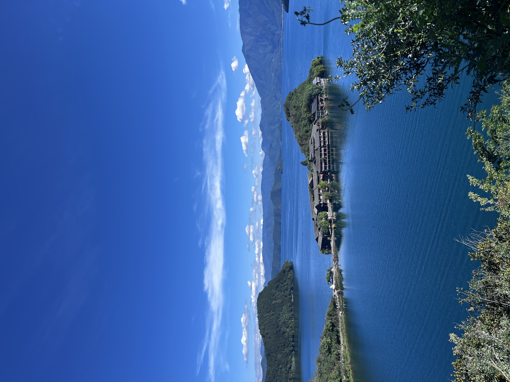
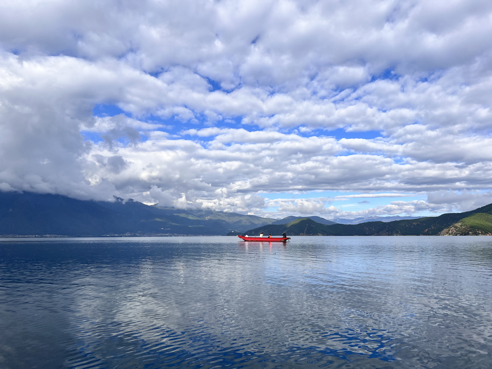
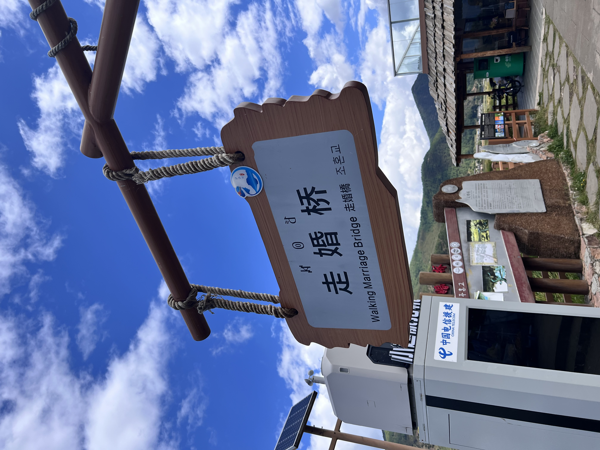

# 背景

2026年国庆，我把目的地定在云南泸沽湖

泸沽湖位于四川省凉山州盐源县与云南省丽江市宁蒗县交界处，为川滇共辖。湖东是盐源县泸沽湖镇，湖西是宁蒗县永宁乡。名字很美，但去一趟，并不轻松

一路翻山、跨江、再翻山。风景在车窗外交替，一路走下来，心里留下几个词：大山、团结、走婚

# 翻越大山之难

已经是2026年了，著名的泸沽湖依然没有高速公路

从丽江市区出发，只能走国道，导航显示4—5小时，全程车速基本在60km/h左右。一座山接一座山，跨过金沙江，再翻山越岭到宁蒗县城；司机加完油，继续上山、下山，最后才抵达美丽的泸沽湖畔

我这个从山沟里走出来的人，从小就领教过出山的艰辛，可到了云南，才发现这里的山更大、更深。如今有国道已经算方便，若放在从前，出门该有多难。那种艰辛，我总觉得，至少是我儿时出山难的十倍有余

# 一家人，不分家

返程路上，我和开车的姐姐闲聊，她是摩挲族人，成家较早，孩子已经上大学。我比她只小3岁，孩子才刚上小学，那一刻，真有些汗颜

姐姐说，她们这里很看重一家人在一起，婚后常常不分家，目前弟媳在家看护孩子、照顾老人，其他人都在外挣钱；逢年过节，她会给弟媳买衣服，但是弟媳说浪费钱，说穿她旧的衣服就行。大家还是住在一起，互相搭把手，不会计较，有苦同吃

这让我想到，有些地方婚后习惯分家另过，兄弟之间也难免磕碰；而她们这种大家庭式的互助，有一种朴素而踏实的力量

不是谁比谁更好，而是生活方式不同，各有温度

# 摩梭人的走婚文化：不是猎奇，是尊重

到了泸沽湖，绕不开摩梭人的“走婚”

但走婚并不是外界想象中那样随意，它更多是摩梭人传统母系大家庭里的一种走访婚形式：男女以感情为基础，各自生活在自己的母家，男方夜晚到女方家走访，清晨返回；所生子女由女方家庭抚养，舅舅在家庭中承担重要角色

当然，随着旅游开发和现代生活影响，摩梭人的生活方式也在变化。走婚不是猎奇标签，而是一种需要被尊重的文化传统

到当地旅行，最好的态度是：多听、多看、少打扰，不把别人的生活当奇观

# 写在最后

这趟国庆云南行，我记住了泸沽湖的蓝，也记住了山路的长

更记住了大山里的人们，对家的理解、对亲人的照顾、对传统的守护

旅行不只是看风景，也是看别人如何生活，再回头看看自己

2026年国庆，云南给我的，不止一张照片

如果你也去过泸沽湖，欢迎留言聊聊：你翻过的那座山，遇见了什么人？

**************************************************************************
**以上是自己实践中遇到的一些问题，分享出来供大家参考学习，欢迎关注微信公众号：DataShare ，不定期分享干货**

